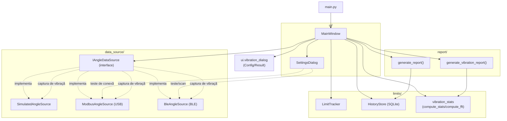
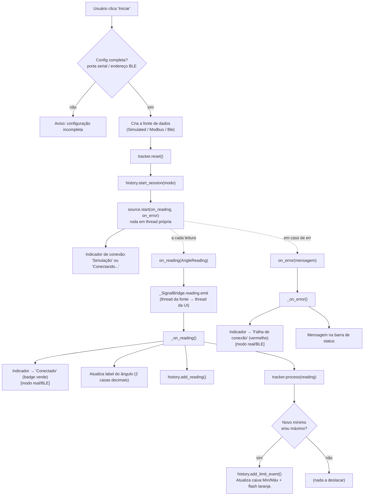
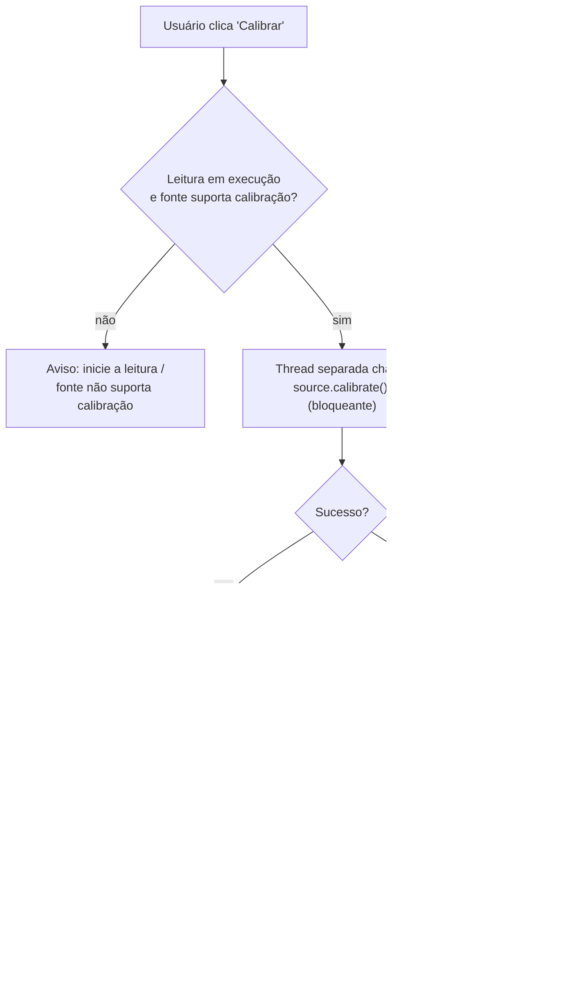
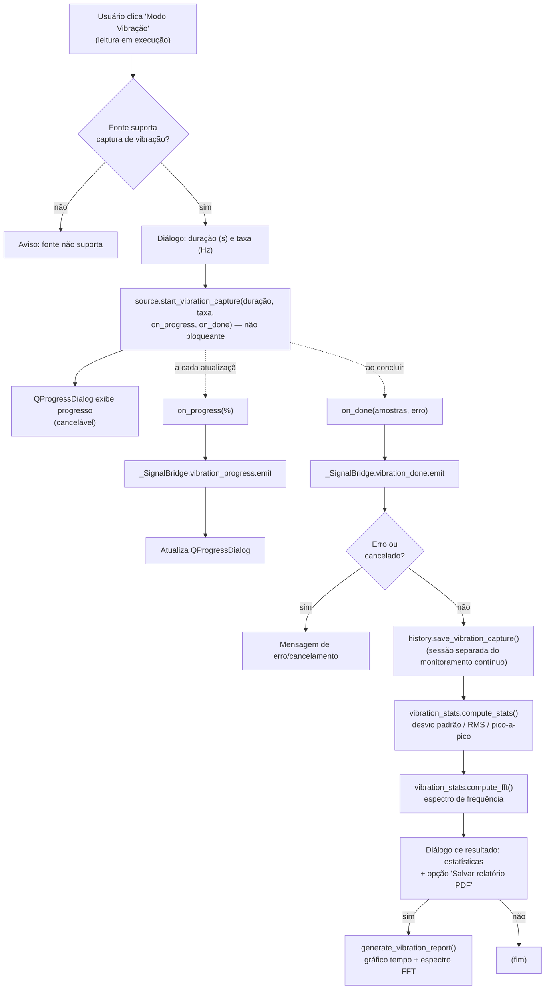
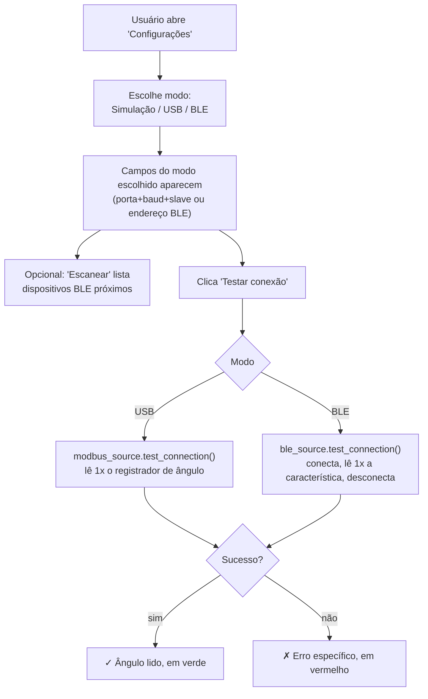
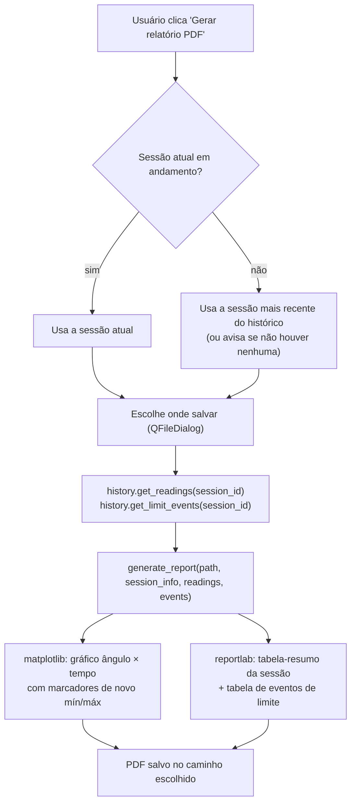

# Fluxograma — Software Desktop (`python-app/`, PyQt5)

Documentação inicial da arquitetura e dos fluxos de execução do software
desktop, para facilitar a leitura do código em análises futuras. Cobre tudo
que já foi implementado até este ponto do projeto (o app Android segue a
mesma arquitetura geral, mas com sua própria implementação em Kotlin).

## O que o software faz até aqui

- Lê o ângulo do inclinômetro (-60° a +60°) em tempo real, por um de três modos:
  **Simulação** (dados sintéticos), **USB/Modbus RTU** (cabo direto ao
  ESP32) ou **Bluetooth BLE** — o firmware do ESP32 já implementa os dois
  modos reais (`firmware/`), mas ainda não foi validado contra hardware
  físico.
- Rastreia os limites (mínimo/máximo) atingidos durante a sessão e destaca
  na tela quando um novo extremo é registrado.
- Permite **calibrar** (zerar o eixo de tilt na posição atual).
- Permite **testar a conexão** (USB ou BLE) antes de iniciar uma sessão.
- Grava cada leitura e cada evento de limite em SQLite, por sessão.
- Gera um **relatório em PDF** (gráfico do ângulo ao longo do tempo + tabela
  de eventos de limite + resumo) a partir do histórico de uma sessão.
- Permite um **Modo Vibração**: captura em alta taxa (ex: 50Hz) por um
  período configurável, para caracterizar variação angular por vento/vibração
  (ex: mastro de pan-tilt) — calcula desvio padrão/RMS/pico-a-pico e o
  espectro de frequência (FFT), com relatório em PDF próprio.
- Interface com a identidade visual da Avibras Aeroco (fundo azul marinho,
  detalhes em laranja, logo opcional no canto superior direito).

## 1. Arquitetura — módulos e dependências

`IAngleDataSource` é o ponto-chave da arquitetura: a UI e toda a lógica de
limites/histórico/relatório trabalham só com essa interface, então trocar
entre simulação e hardware real (USB ou BLE) não exige nenhuma mudança no
resto do app.

## 2. Fluxo principal — Iniciar leitura

## 3. Fluxo — Calibrar

## 4. Fluxo — Modo Vibração

Simulação: gera uma vibração sintética (duas senoides de baixa amplitude +
ruído) — testável de ponta a ponta neste ambiente. USB/BLE seguem o
contrato implementado no firmware (registradores Modbus / características
BLE), ainda sem hardware real para validar.

## 5. Fluxo — Testar conexão (Configurações)

## 6. Fluxo — Gerar relatório PDF

## Notas para próximas análises

- Os fluxos reais (USB, BLE) seguem contratos já **implementados no
  firmware** (`firmware/`), documentados nos comentários de topo de
  `data_source/modbus_source.py` e `data_source/ble_source.py` — mas ainda
  precisam ser confirmados/ajustados quando o firmware for de fato
  compilado e testado em hardware real. Isso inclui o contrato de captura
  de vibração (registradores/coils Modbus e characteristics BLE) — só o
  caminho de **simulação** foi testado de ponta a ponta neste ambiente;
  USB/BLE não puderam ser validados contra hardware real.
- `LimitTracker` e `HistoryStore` são agnósticos à fonte de dados: qualquer
  nova fonte que implemente `IAngleDataSource` funciona sem alterações no
  resto do app.
- O app Android (`android-app/`) replica esta mesma arquitetura em
  Kotlin/Compose (fonte de dados plugável, rastreio de limites, histórico em
  Room, relatório em PDF nativo), mas ainda não teve o build validado neste
  ambiente — ver `android-app/README.md`.
